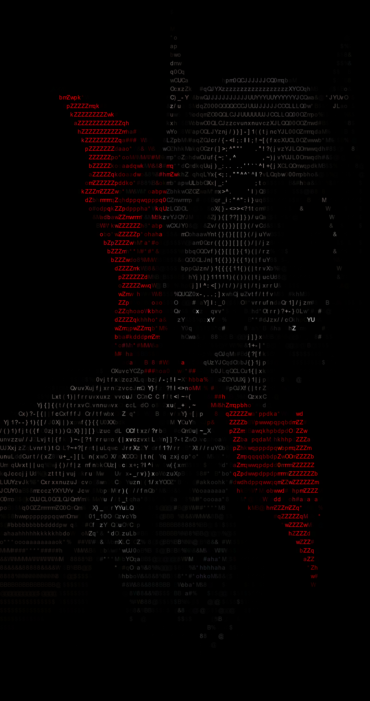

# 🎨 Pascii - Python ASCII Image Generator

> Convert complex images into stunning ASCII art with colors using Python!

`pascii` is a CLI tool that converts images into colored ASCII art images. It resizes, processes, and colors images using an ASCII character set and outputs a PNG file of the result.

---

## 📸 Sample Output

| Original Image | ASCII Output |
|----------------|--------------|
|  |  |

---

## 🚀 Features

- ✅ Converts images into ASCII-art.
- ✅ Preserves original colors using OpenCV & PIL.
- ✅ Handles high-detail and stylized images.
- ✅ Automatically finds images from `images/` folder.
- ✅ Output saved as high-resolution `.png`.

---

## 🧰 Requirements

Install the required Python packages:

```bash
pip install pillow numpy opencv-python
```

---

## ⚙️ Usage

### 🔹 Option 1: Convert a specific image

```bash
python pascii.py path/to/image.jpg --width 120
```

### 🔹 Option 2: Auto-detect from `images/` folder

```bash
python pascii.py
```

You'll be prompted to choose from available images.

---

## 🗂 Directory Structure

```
project-root/
│
├── pascii.py
├── images/              # Put your input images here
│   └── sample.jpg
├── ASCII_Img/           # ASCII art outputs saved here
│   └── sample.png
```

---

## 🖼 Supported Formats

Supports `.png`, `.jpg`, `.jpeg`, `.bmp`, `.gif`

---

